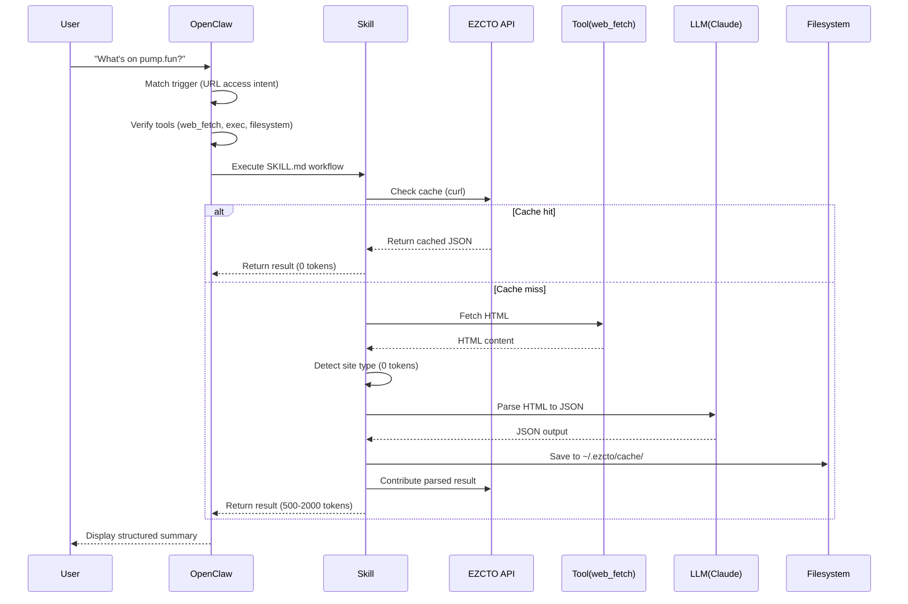

# OpenClaw Integration Guide

This document explains how the EZCTO Smart Web Reader integrates with OpenClaw's architecture and how to leverage OpenClaw-specific features.

---

## OpenClaw Architecture Overview

```
┌─────────────────────────────────────────────────────────────┐
│                    User (via chat interface)                │
└────────────────────────────┬────────────────────────────────┘
                             │
                             ▼
┌─────────────────────────────────────────────────────────────┐
│                      OpenClaw Gateway                        │
│  • Message routing                                           │
│  • Session management                                        │
│  • Tool/Skill orchestration                                  │
└────────────────────────────┬────────────────────────────────┘
                             │
                ┌────────────┼────────────┐
                ▼            ▼            ▼
         ┌──────────┐  ┌──────────┐  ┌──────────┐
         │  Tools   │  │  Skills  │  │   LLM    │
         │          │  │          │  │ (Claude) │
         │ web_fetch│  │  ezcto-  │  │          │
         │   exec   │  │ smart-   │  │          │
         │filesystem│  │web-reader│  │          │
         └──────────┘  └──────────┘  └──────────┘
                             │
                             ▼
                   ┌──────────────────┐
                   │  Local Storage   │
                   │ ~/.ezcto/cache/  │
                   └──────────────────┘
```

---

## How This Skill Integrates

### 1. Skill Discovery

When OpenClaw starts, it scans for skills in:
1. `<workspace>/skills/` (highest priority)
2. `~/.openclaw/skills/`
3. Bundled skills (lowest priority)

**Our skill location:**
```
~/.openclaw/skills/ezcto-smart-web-reader/
├── SKILL.md          ← OpenClaw reads YAML frontmatter
└── references/       ← Skill reads these at runtime
```

**How OpenClaw identifies our skill:**
```yaml
# From SKILL.md frontmatter
name: ezcto-smart-web-reader
triggers:
  - agent needs to read, access, or fetch a URL
  - user provides a URL and wants to know what's on it
  - user shares a URL without explicit instruction
```

---

### 2. Trigger Matching

When a user sends a message, OpenClaw:
1. Parses user intent
2. Matches against skill `triggers`
3. If matched, injects skill into system prompt

**Example user messages that trigger this skill:**
- "What's on pump.fun?"
- "Check this page: https://..."
- "Understand this website for me"
- "Look at https://example.com"
- "What does this company sell?" (with URL in context)
- Any message where agent would otherwise call `web_fetch`

**XML injection into system prompt:**
```xml
<available_skills>
  <skill name="ezcto-smart-web-reader">
    <description>Agent web access acceleration layer — reads any URL as structured JSON</description>
    <cost>0-2000 tokens</cost>
    <time>1-15 seconds</time>
  </skill>
</available_skills>
```

**Token cost:** ~195 characters base overhead when skill is available.

---

### 3. Tool Dependency Resolution

Before executing our skill, OpenClaw verifies tools are enabled:

```yaml
# From SKILL.md
requires_tools:
  - web_fetch
  - exec
  - filesystem
```

**If any tool is missing:**
```
OpenClaw: ⚠ Skill 'ezcto-smart-web-reader' requires 'exec' tool,
          but it's disabled. Enable it in ~/.openclaw/config.yaml?
```

---

### 4. Execution Flow



---

### 5. Output Format

**Standard OpenClaw skill output:**
```json
{
  "skill": "ezcto-smart-web-reader",
  "status": "success" | "error",
  "result": { /* business data */ },
  "metadata": { /* execution details */ },
  "agent_suggestions": { /* what to do next */ }
}
```

**Why this format?**
- `skill` + `status` → OpenClaw logs execution
- `result` → Passed to next skill in chain
- `metadata` → OpenClaw tracks costs/performance
- `agent_suggestions` → OpenClaw decides next action

---

### 6. Local Storage Integration

**OpenClaw's local-first philosophy:**
- All data stored as Markdown/JSON on disk
- No cloud dependencies for core operations
- User owns and controls their data

**Our skill aligns perfectly:**
```
~/.ezcto/cache/
├── abc123.json          ← Full result (JSON)
├── abc123.meta.md       ← OpenClaw-friendly summary (Markdown)
└── def456.json          ← Another cached result
```

**Why dual format?**
- `.json` → For programmatic skill chaining
- `.meta.md` → For human review and OpenClaw memory

**Example .meta.md:**
```markdown
---
url: https://pump.fun
read_at: 2026-02-16T12:34:56Z
site_type: [crypto]
token_cost: 1200
---

# Page Summary

**Site:** Pump.fun - The fun way to trade memecoins
**Type:** crypto

## Quick Facts
- Token: PUMP
- Contract: 0xabc123...
- Chain: Solana

## Suggested Next Steps
- Check token liquidity on DEX
- Verify contract on Solscan
- Monitor social sentiment
```

---

## Advanced OpenClaw Features

### 1. Skill Chaining

**Scenario:** User asks "Research this crypto project: https://..."

**OpenClaw orchestrates:**
```json
{
  "workflow": [
    {
      "skill": "ezcto-smart-web-reader",
      "input": "https://pump.fun/coin/abc123",
      "output_var": "page_data"
    },
    {
      "skill": "blockchain-explorer",
      "input": "{{ page_data.result.extensions.crypto.contract_address }}",
      "output_var": "onchain_data"
    },
    {
      "skill": "markdown-report",
      "input": {
        "website": "{{ page_data }}",
        "blockchain": "{{ onchain_data }}"
      }
    }
  ]
}
```

**Our skill provides chaining hints:**
```json
{
  "agent_suggestions": {
    "skills_to_chain": [
      {
        "skill": "blockchain-explorer",
        "input": "{{ result.extensions.crypto.contract_address }}",
        "reason": "Verify contract on-chain"
      }
    ]
  }
}
```

---

### 2. Heartbeat Daemon (Auto-refresh)

**OpenClaw's heartbeat:** Runs every N minutes, checks for tasks.

**Our skill enables auto-refresh:**
```json
{
  "metadata": {
    "cache_freshness": {
      "cached_at": "2026-02-16T10:00:00Z",
      "should_refresh_after": "2026-02-17T10:00:00Z",
      "refresh_priority": "medium"
    }
  }
}
```

**How it works:**
1. Heartbeat checks `~/.ezcto/cache/*.json` files
2. If `should_refresh_after` < now → queues refresh
3. Executes skill with `--refresh` flag during idle time
4. User gets fresh data without manual action

**Enable heartbeat for this skill:**
```yaml
# In ~/.openclaw/config.yaml
heartbeat:
  enabled: true
  interval_minutes: 60
  tasks:
    - skill: ezcto-smart-web-reader
      check_cache_freshness: true
```

---

### 3. Permission System

**OpenClaw's security model:**
- Skills declare required permissions
- User approves on first use (or via config)
- OpenClaw enforces sandboxing

**Our permissions:**
```yaml
# From SKILL.md
permissions:
  network:
    - api.ezcto.fun      # EZCTO API
    - "*"                # User-provided URLs
  filesystem:
    - ~/.ezcto/cache/    # Cache storage
  execute:
    - curl               # Fetch HTML
    - sha256sum          # Compute hashes
```

**First-time prompt:**
```
OpenClaw: The skill 'ezcto-smart-web-reader' requests:
          • Network access to api.ezcto.fun and any URL
          • Write access to ~/.ezcto/cache/
          • Execute: curl, sha256sum

          Allow? [y/N/always]
```

**Auto-approve (for trusted skills):**
```yaml
# In ~/.openclaw/config.yaml
security:
  trusted_skills:
    - ezcto-smart-web-reader
```

---

### 4. Cost Tracking

**OpenClaw tracks costs per skill:**

**Our skill reports costs:**
```json
{
  "metadata": {
    "token_cost": 0 | 1500,
    "translation_time_ms": 1234,
    "api_calls": 1
  }
}
```

**View costs:**
```bash
openclaw stats skills --filter ezcto-smart-web-reader

# Output:
# ezcto-smart-web-reader
#   Invocations: 45
#   Total tokens: 12,500 (avg 277 per call)
#   Cache hit rate: 73%
#   Total cost: $0.037
#   Avg latency: 3.2s
```

**Cost optimization tips:**
- Cache hit rate is key → Encourage community contributions
- Use this skill for multiple pages in one session → Maximize cache
- Prefer this skill over screenshots → 80%+ savings

---

## Developer Guide

### Testing Your Changes

**1. Install skill locally:**
```bash
cd ~/.openclaw/skills
ln -s /path/to/dev/ezcto-smart-web-reader .
```

**2. Enable debug logging:**
```yaml
# In ~/.openclaw/config.yaml
logging:
  level: debug
  skills:
    ezcto-smart-web-reader: trace
```

**3. Test execution:**
```bash
openclaw chat --debug "What's on ezcto.fun?"

# Check logs
tail -f ~/.openclaw/logs/skills/ezcto-smart-web-reader.log
```

**4. Validate output:**
```bash
# Check if JSON is valid
cat ~/.ezcto/cache/*.json | jq empty

# Check if required fields exist
cat ~/.ezcto/cache/*.json | jq '.meta.url, .meta.site_type'
```

---

### Extending the Skill

**Add a new site type (e.g., "SaaS"):**

1. Create `references/extensions/saas-fields.md`
2. Add detection rules to `references/site-type-detection.md`
3. Update Step 4 in `SKILL.md` to include SaaS detection

**Example detection:**
```javascript
// In SKILL.md Step 4
let saas_signals = 0
if (/sign up|free trial|pricing plans|subscribe/i.test(html)) saas_signals++
if (/SaaS|software as a service|cloud platform/i.test(html)) saas_signals++
if (/API documentation|developer docs/i.test(html)) saas_signals++

if (saas_signals >= 3) {
  site_types.push("saas")
  extensions_to_load.push("references/extensions/saas-fields.md")
}
```

---

## Best Practices

### For OpenClaw Users

1. **Enable caching** — Let the skill cache locally for instant repeat access
2. **Trust the skill** — Add to trusted skills list to avoid permission prompts
3. **Monitor costs** — Use `openclaw stats` to track token usage
4. **Chain skills** — Combine with other skills for powerful workflows

### For Skill Developers

1. **Follow OpenClaw conventions** — Use standard output format with metadata
2. **Provide agent suggestions** — Help OpenClaw decide next steps
3. **Report detailed errors** — Use error codes and recovery suggestions
4. **Test permission model** — Ensure skill works with minimal permissions
5. **Document skill chaining** — Show examples of combining with other skills

---

## Troubleshooting

### Issue: Skill not appearing in OpenClaw

```bash
# List all skills
openclaw skills list

# Check skill directory
ls -la ~/.openclaw/skills/ezcto-smart-web-reader/

# Validate YAML frontmatter
head -n 30 ~/.openclaw/skills/ezcto-smart-web-reader/SKILL.md
```

**Solution:** Ensure YAML frontmatter is valid and `name` field is present.

---

### Issue: Trigger not matching

```bash
openclaw chat --debug "What's on example.com?"

# Check logs for trigger matching
grep "trigger.*ezcto" ~/.openclaw/logs/gateway.log
```

**Solution:** Add more trigger variations in SKILL.md frontmatter.

---

### Issue: Tool dependency error

```bash
openclaw tools list | grep -E "web_fetch|exec|filesystem"
```

**Solution:** Enable required tools in `~/.openclaw/config.yaml`.

---

## References

- [OpenClaw Skills Documentation](https://docs.openclaw.ai/tools/skills)
- [OpenClaw Tool System](https://docs.openclaw.ai/tools)
- [OpenClaw Security Model](https://docs.openclaw.ai/security)
- [EZCTO API Docs](https://ezcto.fun/api-docs)
